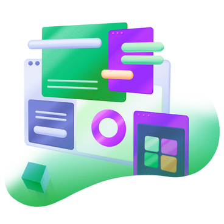

<!-- 
Thank you for using this README template! I hope it helps you create a clear and informative README for your project.

Consider giving it a star ⭐️ if it was useful!
-->

<!-- A starting point for the "back to top" -->

<!-- Replace this logo with your own -->

  
   

  <h3><b>Minimal README Template</b></h3>

 

<!-- About the Project -->
## About The Project
Tired of complicated README templates?  
This minimalistic template offers straightforward yet powerful project documentation.  
Say goodbye to bulky emoji headers and extensive table of contents – enjoy a simple, clean approach.

_**Click on `"use this template"` to kickstart your project with ease.**_

<!-- Add tech stacks you used for the proejct -->
### Technologies
Enumerate the technologies, frameworks, libraries, and tools used in the project.
* [![][python-logo]][python-url]
* [![][fastapi-logo]][fastapi-url]
* [![][mongodb-logo]][mongodb-url]
* [![][kubernetes-logo]][kubernetes-url]
* [![][octopusdeploy-logo]][octopusdeploy-url]

 

<!-- Getting Started -->
## Getting Started

### Requirements
List any prerequisites or dependencies needed to run the project.

<!-- example -->
- Python 3.7+
- FastAPI
- MongoDB

### Installation
Outline the steps required to install and set up the project environment.

<!-- example -->
1. Clone the repository
2. Install backend dependencies: `pip install -r requirements.txt`
3. Install frontend dependencies: `npm install`
4. Start the server: `python manage.py runserver`

 

<!-- Usage -->
## Usage
Describe how to use the project once it's set up.  
Provide examples such as code snippets and screenshots.

 

<!-- Roadmap -->
## Roadmap
Outlines upcoming features, improvements, and milestones for future development.

<!-- example -->
- [x] Implement user authentication system
- [ ] Introduce a real-time messaging feature
- [ ] Multi-language Support
    - [ ] Korean
    - [ ] DoggoLingo

 

<!-- Contributing -->
## Contributing
Detail the instructions for contributing to the project.

<!-- example -->
1. Fork the repository.
2. Create a new branch for your feature: `git checkout -b feature-name`.
3. Make your changes and commit them: `git commit -m 'Add new feature'`.
4. Push to the branch: `git push origin feature-name`.
5. Submit a pull request.

 

<!-- License -->
## License
Licensed under the MIT License - see the LICENSE file for details.

<!-- Back to top -->

(<a href="#readme-top">back to top</a>)

<!-- Stack Logos and Links -->
[python-logo]: https://img.shields.io/badge/python-3670A0?style=for-the-badge&logo=python&logoColor=ffdd54
[python-url]: https://www.python.org/
[fastapi-logo]: https://img.shields.io/badge/FastAPI-005571?style=for-the-badge&logo=fastapi
[fastapi-url]:https://fastapi.tiangolo.com/
[mongodb-logo]: https://img.shields.io/badge/MongoDB-%234ea94b.svg?style=for-the-badge&logo=mongodb&logoColor=white
[mongodb-url]: https://www.mongodb.com/
[kubernetes-logo]: https://img.shields.io/badge/kubernetes-%23326ce5.svg?style=for-the-badge&logo=kubernetes&logoColor=white
[kubernetes-url]: https://kubernetes.io/
[octopusdeploy-logo]: https://img.shields.io/badge/octopus%20deploy-0D80D8?style=for-the-badge&logo=octopusdeploy&logoColor=white
[octopusdeploy-url]: https://octopus.com/company

<!-- 
Reference
Icons8 - logo image
shields.io - stack logos
-->
